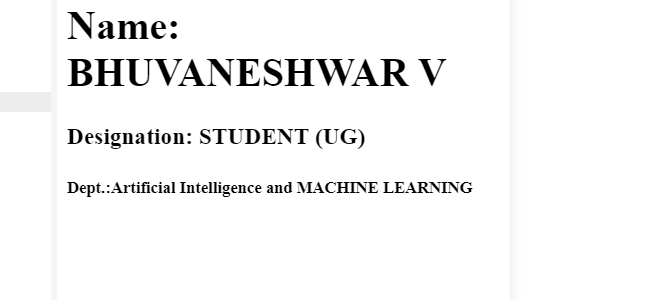

# Experiment_Basic_HTML_Tag

## AIM
To Write a html webpage using heading, paragraph and list tags.

# ALGORITHM
### STEP 1
create a simple html page using heading tag
### STEP 2
Add a paragragh tag to the program
### STEP 3
Add your Name and Reference Number using heading tag
### STEP 4
Execute the program

# CODE
~~~
<html>

<body>
<h1>Name: BHUVANESHWAR V</h1>
<h3>Designation: STUDENT (UG) </h3>
<h5>Dept.:Artificial Intelligence and MACHINE LEARNING</h5>
</body>

</html>
~~~
# OUPUT

